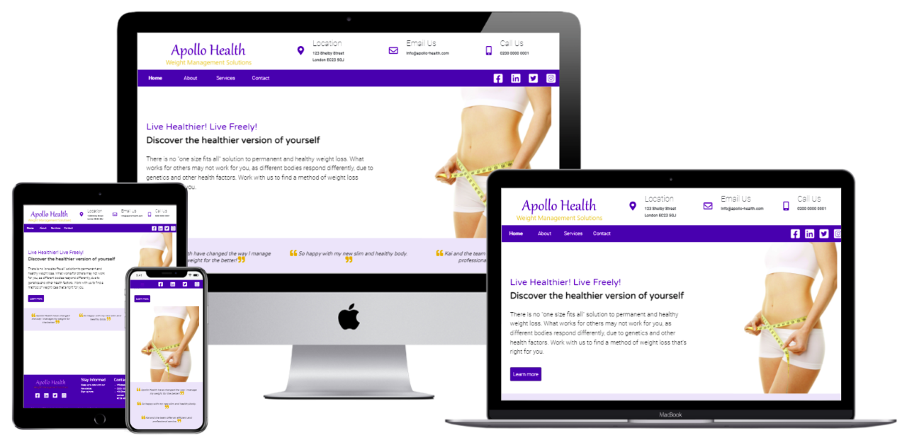
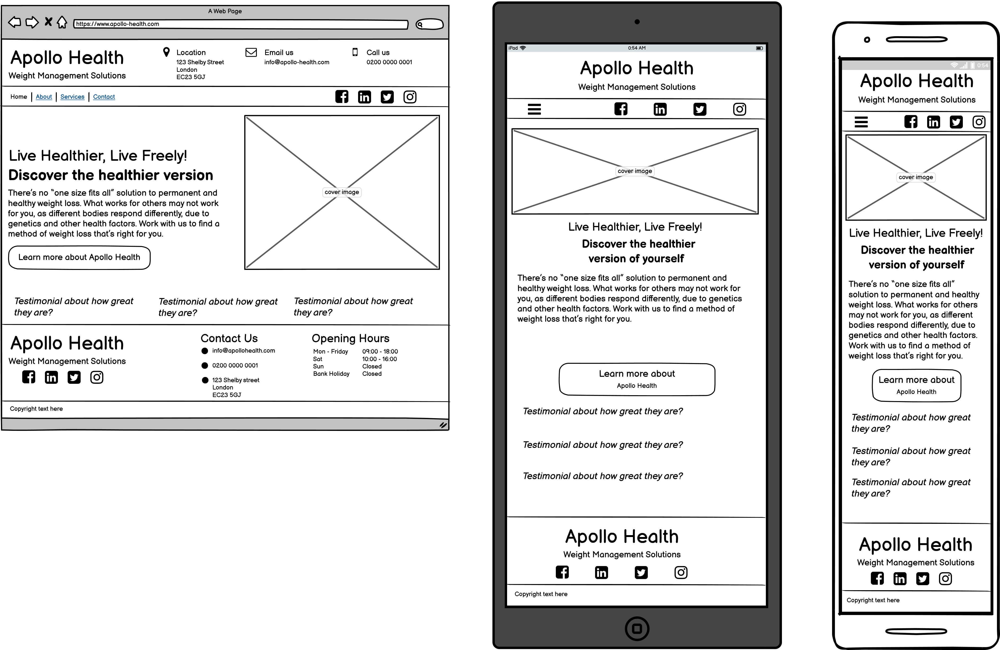
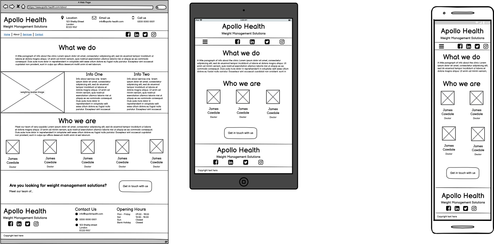
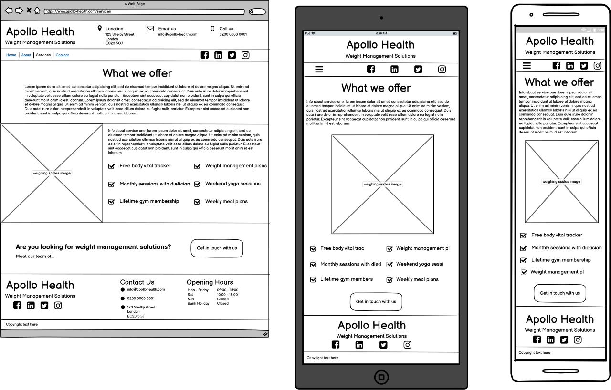
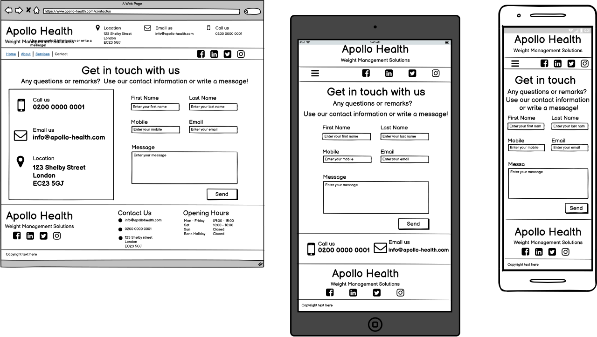

<h1 align="center">Apollo Health Website</h1>

[View the live project here.](https://sarah-lb.github.io/my-first-project/)

This is the main marketing website for Apollo Health. It is designed to be responsive and accessible on a range of devices, making it easy to navigate for potential clients.

<h2 align="center"></h2>

## User Experience (UX)

-   ### User stories

    -   #### First Time Visitor Goals

        1. As a First Time Visitor, I want to easily understand the main purpose of the site and learn more about the company and what they offer.
        2. As a First Time Visitor, I want to be able to easily navigate throughout the site to find content.
        3. As a First Time Visitor, I want to look for testimonials to understand what their users think of them and see if they are trusted. I also want to locate their social media links to see their followings on social media to determine how trusted and known they are.

    -   #### Returning Visitor Goals

        1. As a Returning Visitor, I want to find information about pricing structure.
        2. As a Returning Visitor, I want to find the best way to get in contact with the company with any questions I may have.
        3. As a Returning Visitor, I want to find community links.

    -   #### Frequent User Goals
        1. As a Frequent User, I want to check to see if there are any newly added procedures or discounts/offers.
        2. As a Frequent User, I want to sign up to the Newsletter so that I am emailed any major updates and/or changes to the website or company offering.

    -   #### Business Goals
        1. As a business, we want to establish an online presence.
        2. As a business, we want to increase visibility and present clear information about what we offer.
        3. As a business, we want to increase signup to our newsletter.
        4. As a business we want to increase client enquiries and secure sales.

-   ### Design
    -   #### Colour Scheme
        -   The two main colours used are blue and white.  White offers a clear, sterile and clinical feel, while blue generates a sense of trust, intelligence and clear communication,.  Warm and comforting orange is used in the logo to balance the cool blues and white. It is used to highlight sections and draw the eye to certain areas of the page. 

    -   #### Typography
        -   The Roboto font is the main font used throughout the whole website with Sans Serif as the fallback font in case for any reason the font isn't being imported into the site correctly. Roboto is a clean and clear font, making it appropriate for this site.
    -   #### Imagery
        -   The large hero image is designed to catch the user's attention and encourage them to delve further into the site. It also has a clean and healthy aesthetic.

*   ### Wireframes

    -   Home Page Wireframe: <h2 align="center"></h2>

    -   About Page Wireframe: <h2 align="center"></h2>

    -   Services Page Wireframe: <h2 align="center"></h2>

    -   Contact Us Page Wireframe: <h2 align="center"></h2>

## Features

-   Responsive on all device sizes.

-   Interactive elements such as newsletter sign up, contact form and embedded google maps.

## Technologies Used

### Languages Used

-   [HTML5](https://en.wikipedia.org/wiki/HTML5)
-   [CSS3](https://en.wikipedia.org/wiki/Cascading_Style_Sheets)

### Frameworks, Libraries & Programs Used

1. [Bootstrap 4.5:](https://getbootstrap.com/docs/4.5/getting-started/introduction/)
    - Bootstrap was used to assist with the responsiveness and styling of the website.
1. [Hover.css:](https://ianlunn.github.io/Hover/)
    - Hover.css was used on the list of menu items in the navbar to add the grow transition while being hovered over.
1. [Google Fonts:](https://fonts.google.com/)
    - Google fonts were used to import the 'Roboto' and 'Varela Round' fonts into every html file in the project.
1. [Font Awesome:](https://fontawesome.com/)
    - Font Awesome was used on all pages throughout the website to add icons for aesthetic and UX purposes.
1. [jQuery:](https://jquery.com/)
    - jQuery came with Bootstrap to make the navbar responsive and create a modal signup form.
1. [Git](https://git-scm.com/)
    - Git was used for version control by utilizing the Gitpod terminal to commit to Git and Push to GitHub.
1. [GitHub:](https://github.com/)
    - GitHub is used to store the projects code after being pushed from Git.
1. [GIMP Image Editor Pro:](https://www.gimp.org/)
    - GIMP was used to create the logo for the website, used in the header and footer.
1. [Balsamiq:](https://balsamiq.com/)
    - Balsamiq was used to create the wireframes during the design process.
1. [TinyPNG:](https://tinypng.com/)
    - TinyPNG was used to reduce the size of some image files for faster loading.

## Testing

The W3C Markup Validator and W3C CSS Validator Services were used to validate every page of the project to ensure there were no syntax errors in the project.

-   [W3C Markup Validator](https://validator.w3.org/#validate_by_input)
-   [W3C CSS Validator](https://jigsaw.w3.org/css-validator/#validate_by_input)
-   Lighthouse used for responsiveness, compatability, accessibility... etc
-   [HTML formatter](https://webformatter.com/html)

### Testing User Stories from User Experience (UX) Section

-   #### First Time Visitor Goals
       
    1. As a First Time Visitor, I want to easily understand the main purpose of the site and learn more about the company and what they offer.

        1. Upon entering the site, users are automatically greeted with a clean and easily readable navigation bar to go to the page of their choice. Underneath there is a Hero Image with Text and a "Learn More" Call to action button.
        2. The main purpose of the site, weight-loss, is made immediately clear with the hero image.
        3. The user has two options, click the call to action button or scroll down for more information.

    2. As a First Time Visitor, I want to be able to easily be able to navigate throughout the site to find content.

        1. The site has been designed to be fluid and never to entrap the user. At the top of each page there is a clean navigation bar, each link describes what the page they will end up at clearly.
        2. At the bottom of the first 3 pages there is a redirection call to action to ensure the user always has somewhere to go and doesn't feel trapped as they get to the bottom of the page.

    3. As a First Time Visitor, I want to look for testimonials to understand what their users think of them and see if they are trusted. I also want to locate their social media links to see their following on social media to determine how trusted and known they are.
        1. On the homepage there are large, clear testimonials to reassure the user on first glance.
        2. As well as having clear contact information and social media links in the header, the user can also scroll to the bottom of any page on the site to locate social media links in the footer.
        3. Before the form on the Contact Us page, the user is told that alternatively they can contact the organisation using the contact information which is repeated.

-   #### Returning Visitor Goals

    1. As a Returning Visitor, I want to find information about pricing structure.

        1. This is clearly shown in a table on the Services page.
        2. Contact information is displayed in the header and footer on every page so any queries can be communicated.

    2. As a Returning Visitor, I want to find the best way to get in contact with the company with any questions I may have.

        1. The navigation bar clearly highlights the "Contact Us" Page with a form to complete.
        2. The header and footer both contain contact information as well as links to the organisations Facebook, Linked In Twitter and Instagram pages.
        4. Whichever social media link they click, it will open up in a new tab to ensure the user can easily get back to the website.

    3. As a Returning Visitor, I want to find community links.
        1. The social media pages can be found in the header and footer of every page and will open a new tab for the user.
      
        1. As a Frequent User, I want to check to see if there are any newly added procedures or discounts/offers.
        2. As a Frequent User, I want to sign up to the Newsletter so that I am emailed any major updates and/or changes to the website or company offering.

-   #### Frequent User Goals

    1. As a Frequent User, I want to check to see if there are any newly added procedures or discounts/offers.

        1. The user would already be comfortable with the website layout and can easily check the services page or contact the clinic.
        2. The user can sign up to the newsletter to get regular updates on procedures and offers.

    2. As a Frequent User, I want to sign up to the Newsletter so that I am emailed any major updates and/or changes to the website or company offering.
        1. At the bottom of every page their is a link in the footer to sign up to the newsletter.  This is consistent throughout the site.
        3. There is a "Learn More" button on the homepage which prompts the user to sign up to the newsletter.

-   #### Business Goals

    1. As a business, we want to establish an online presence.

        1. This site clearly introduces the user to the company and what they offer.
        2. There are links to the company social medis pages in the header and footer of each page, encouraging the user to further explore the company's online offering and increase their online audience across a range of platforms.
   
    2. As a business, we want to increase visibility and present clear information about what we offer.

        1. Used code and content to boost search engine results.
        2. Appropriate font and colour scheme chosen so the site is clear and informative.
        3. Simple and responsive layout chosen for clear presentation.
    
    3. As a business, we want to increase signup to our newsletter.

        1. There is a link in the footer of every page to signup to the newsletter.
        2. On the homepage, next to the hero image, there is a "Learn More" button, prompting the user to sign up to the newsletter.

    4. As a business we want to increase client enquiries and secure sales.

        1. There is contact information in the header and footer of every page.
        2. There are social media links in the navbar and footer of every page.
        3. There is a "Get in touch" button on the services page and about page which links to the contact form.


### Further Testing

-   The Website was tested on Google Chrome, Microsoft Edge and Safari browsers.
-   The website was viewed on a variety of devices such as Desktop, Laptop, iPhone5, iPad, Samsung Galaxy, Nokia 1.4.
-   Lighthouse
-   A large amount of testing was done to ensure that all pages were linking correctly.
-   Friends and family members were asked to review the site and documentation to point out any bugs and/or user experience issues.

### Known Bugs

-   The navbar was moved out of the header and into the body in order to make it sticky. The hvr-grow class will now not always work.

### Issues I came across - where to put this?
-   Used vw for font-size but also changed layout for different devices - so had tiny text and icons spanning the whole screen!
    Changed for media queries.
-   text in footer and header wrapping - needed to stop it.
-   needed hero image with transparent background or looked too blocky - used png image
-   TRYING TO IMPLEMENT STICKY NAVBAR!!
       moved navbar out of header to make it sticky.  but then hvr-grow not working on menu items! (known bug - need to fix)
-   CENTERING LEADGENERATOR BUTTON AND HEADINGS - LEARNED ABOUT USING FLEXBOX IN BOOTSTRAP
-   PICS TAKING TOO LONG TO LOAD - MADE SMALLER
-   services.html pic looking oddly cropped on mobile so repositioned using media query
-   navbar drop down text white on white background so couldn't see it - needed to use media query to make background blue.  Text all inline and ontop of each other.  Used media query to remove inline command for md screen sizes.
-   white space on right

## Deployment

### GitHub Pages

The project was deployed to GitHub Pages using the following steps...

1. Log in to GitHub and locate the [GitHub Repository](https://github.com/)
2. At the top of the Repository (not top of page), locate the "Settings" Button on the menu.
    - Alternatively Click [Here](https://raw.githubusercontent.com/) for a GIF demonstrating the process starting from Step 2.
3. Scroll down the Settings page until you locate the "GitHub Pages" Section.
4. Under "Source", click the dropdown called "None" and select "Master Branch".
5. The page will automatically refresh.
6. Scroll back down through the page to locate the now published site [link](https://github.com) in the "GitHub Pages" section.

### Forking the GitHub Repository

By forking the GitHub Repository we make a copy of the original repository on our GitHub account to view and/or make changes without affecting the original repository by using the following steps...

1. Log in to GitHub and locate the [GitHub Repository](https://github.com/)
2. At the top of the Repository (not top of page) just above the "Settings" Button on the menu, locate the "Fork" Button.
3. You should now have a copy of the original repository in your GitHub account.

### Making a Local Clone

1. Log in to GitHub and locate the [GitHub Repository](https://github.com/)
2. Under the repository name, click "Clone or download".
3. To clone the repository using HTTPS, under "Clone with HTTPS", copy the link.
4. Open Git Bash
5. Change the current working directory to the location where you want the cloned directory to be made.
6. Type `git clone`, and then paste the URL you copied in Step 3.

```
$ git clone https://github.com/YOUR-USERNAME/YOUR-REPOSITORY
```

7. Press Enter. Your local clone will be created.

```
$ git clone https://github.com/YOUR-USERNAME/YOUR-REPOSITORY
> Cloning into `CI-Clone`...
> remote: Counting objects: 10, done.
> remote: Compressing objects: 100% (8/8), done.
> remove: Total 10 (delta 1), reused 10 (delta 1)
> Unpacking objects: 100% (10/10), done.
```

Click [Here](https://help.github.com/en/github/creating-cloning-and-archiving-repositories/cloning-a-repository#cloning-a-repository-to-github-desktop) to retrieve pictures for some of the buttons and more detailed explanations of the above process.

## Credits

### Code

-   [Bootstrap4](https://getbootstrap.com/docs/4.5/getting-started/introduction/): Bootstrap Library used throughout the project mainly to make site responsive using the Bootstrap Grid System.

-   Example README.md from Code Institute used as template and edited.

-   The modal signup form was taken from a Code Institute lesson and edited.

-   Dropdown menu for navbar on smaller screens was taken from a Code Institute lesson and edited.

-   [Box shadows](https://getcssscan.com/css-box-shadow-examples): Used code to put box shadows on staff images on about.html page.

### Content

-   Content was written by the developer and clinic owners.

-   The psychological properties of colours were found [here](http://www.colour-affects.co.uk/psychological-properties-of-colours) and used to determine colour scheme of site as described in README.md.

### Media

-   Logo design inspired by example from clinic owners and designed by developer.

-   hero-image-tiny-new image sourced from https://stock.adobe.com/uk/contributor/37954/dmitry-sunagatov?load_type=author&prev_url=detail and resized using Windows Photos.

-   services-tiny-new image sourced from https://stock.adobe.com/uk/contributor/200467009/prostock-studio?load_type=author&prev_url=detail and resized using Windows Photos.

-   anabelle-tiny-new image sourced from https://stock.adobe.com/contributor/200780626/chagin?load_type=author&prev_url=detail and resized using Windows Photos.

-   doctor-tiny image sourced from https://stock.adobe.com/contributor/293582/new-africa?load_type=author&prev_url=detail and resized using [TinyPNG](https://tinypng.com/).

-   emanual-tiny-new image sourced from https://stock.adobe.com/contributor/86820/nyul?load_type=author&prev_url=detail and resized using Windows Photos.

-   john-tiny-new image sourced from https://stock.adobe.com/contributor/9430/kurhan?load_type=author&prev_url=detail and resized using Windows Photos.

-   kai-tiny-new image sourced from https://stock.adobe.com/contributor/205475195/godsandkings?load_type=author&prev_url=detail and resized using Windows Photos.

-   rebecca-tiny image sourced from https://stock.adobe.com/contributor/200404573/andy-dean?load_type=author&prev_url=detail and resized using [TinyPNG](https://tinypng.com/).

-   pa-tiny image and manager-tiny image both created by developer and resized using Windows Photos. 


### Acknowledgements

-   My Mentor, Akshat Garg, for many pointers and helpful feedback.

-   Tutor support at Code Institute for their guidance.